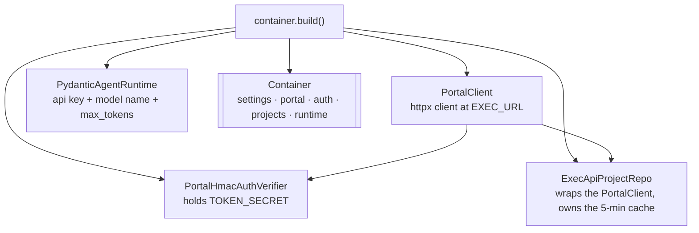
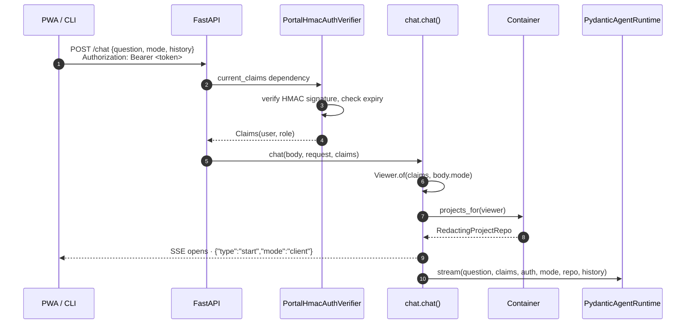
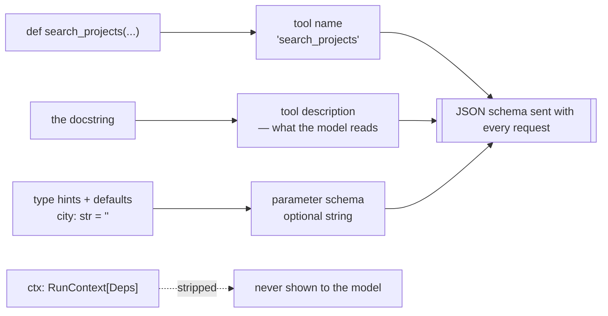
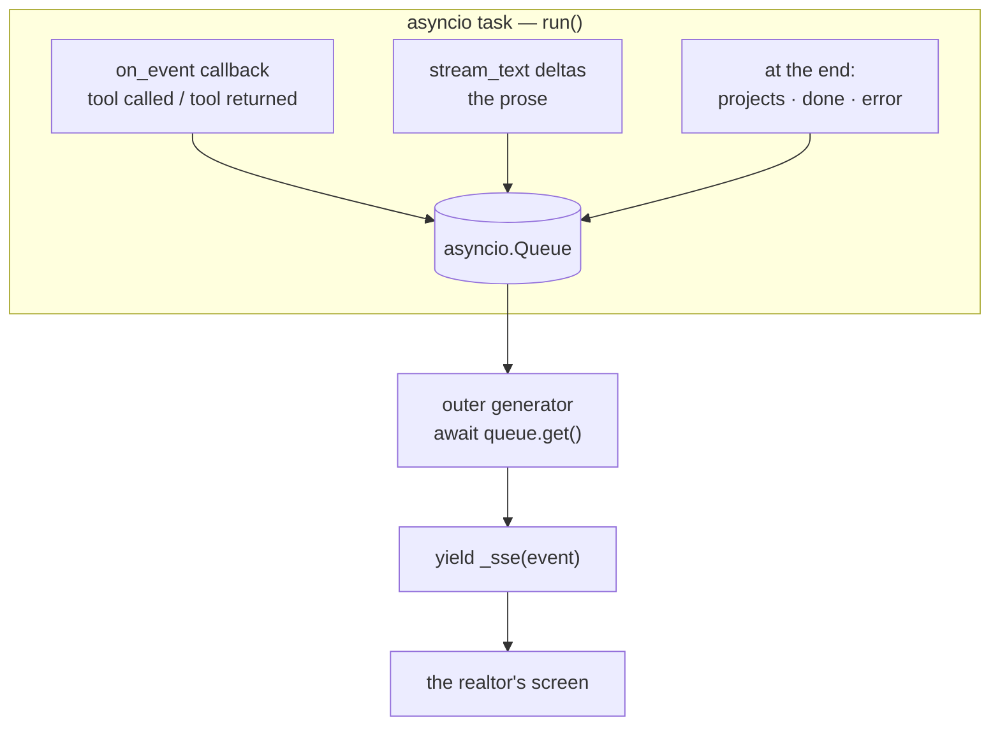
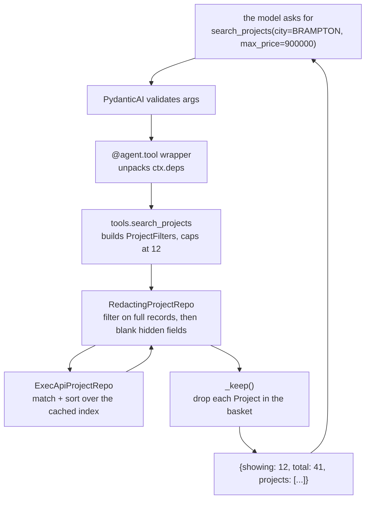
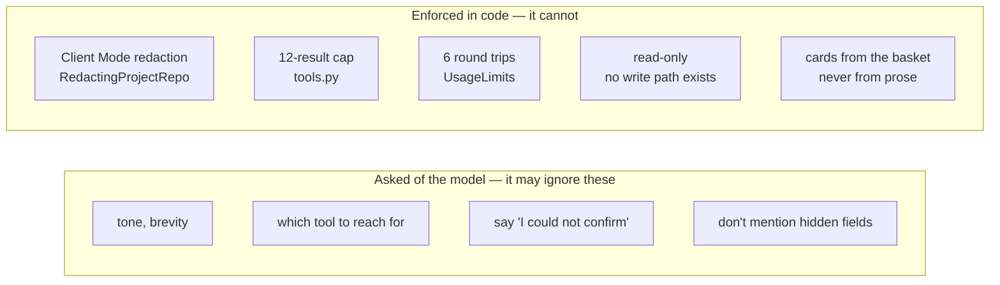

# The agent, end to end

*A companion to [how-it-works.md](how-it-works.md), which traces the whole
system. This one stops at a single question and takes it apart slowly: what
exists before anyone asks anything, what is built per request, what PydanticAI
actually does for us, how the model knows a tool exists, and what happens in the
loop — with one real question followed from keystroke to card.*

Written to be read straight through. Nothing here assumes you remember the
other docs.

---

## 1. Before anyone asks anything: startup

`uvicorn app.main:app` runs [main.py](../../aura-chat/app/main.py). Two things
happen, in this order.

**First, the app is constructed.** `create_app()` reads settings, registers CORS
middleware, and mounts two routers — `/health`, `/doctor`, `/me`, `/login` from
[api.py](../../aura-chat/app/api.py), and `/chat` from
[chat.py](../../aura-chat/app/chat.py). No adapters yet. CORS has to be
registered while the app object is being built, which is why settings are read
here as well as inside the container.

**Then, on startup, the container is built.** The `lifespan` hook calls
`container.build()` ([container.py:47](../../aura-chat/app/container.py#L47)),
the one and only file in the service allowed to construct an adapter:



Note what is **not** built at startup:

- **No Agent object.** `PydanticAgentRuntime.__init__` stores the API key, the
  model name and the token cap, and sets `self._agents = {}`. That's all.
- **No model object.** `OpenAIChatModel` is created lazily, on first use.
- **No project index.** The first question of the day pays for the fetch.

The container lives on `app.state.container` for the life of the process. Every
request reaches it through the `container(request)` dependency
([api.py:13](../../aura-chat/app/api.py#L13)).

**Why lazy?** A provider owns an `AsyncOpenAI` client with a connection pool, and
nothing in this service closes one. Building an agent per request would leave a
pool behind per message until the process ran out of sockets. Building it once,
on first use, and keeping it, is the fix — and it also stops five tools being
re-registered on every question.

---

## 2. The first question wakes the agent

A realtor sends `POST /chat`. Here is the whole path before a single token is
generated.



Four things are settled here, before the model is involved at all:

**Identity is proven, not claimed.** The bearer token is the portal's own HMAC
session token. `current_claims` verifies the signature with `TOKEN_SECRET` and
returns `Claims(user, role)`, or raises 401. The raw token is also stashed on
`request.state.auth_token` — the agent needs to *present* it later, because Aura
holds no credential of its own.

**Mode is a UI state, and is trusted exactly once.** The client says
`mode: "client"`. That is honest — only the client knows whether the phone is
turned toward a buyer. It is used at exactly one place, to pick a `Viewer`, and
after that nothing downstream takes the client's word for anything.

**The Viewer becomes a repo.** `container.projects_for(viewer)` returns a
`RedactingProjectRepo` — the clerk in front of the filing cabinet. This is the
only object the agent will ever be handed. There is no path from a tool back to
the unredacted repo.

**The stream opens immediately** with a `start` event echoing the mode, so the
UI can prove which mode it is in before any content arrives. A realtor must
never wonder whether the screen they just turned around is safe.

Everything that can fail happens *inside* the generator, so a failure arrives as
an `error` event in the stream the caller is already reading — not as a 500 with
an HTML body under a `text/event-stream` request.

---

## 3. What PydanticAI is, and which parts we use

PydanticAI is an agent framework: it owns the conversation with the model,
turns Python functions into tools the model can call, runs the call-and-reply
loop, and validates everything crossing the boundary with Pydantic.

It is imported in **exactly one file**,
[agent_pydantic.py](../../aura-chat/app/adapters/agent_pydantic.py). That is the
whole point of the adapter layer: swapping to LangGraph or a hand-rolled loop is
a rewrite of one file. [tools.py](../../aura-chat/app/tools.py) has never heard
of it.

What the library gives us, and what we actually use:

| Feature | What it does | Do we use it |
|---|---|---|
| `Agent` | Holds the model, the instructions, the tool registry | Yes — one per mode |
| `@agent.tool` | Turns a Python function into a model-callable tool | Yes — five tools |
| Schema from signature | Reads type hints + docstring → JSON schema for the model | Yes, entirely |
| `deps_type` / `RunContext` | Dependency injection into tools, per run | Yes — this is `Deps` |
| `run_stream` | Runs the loop, streams the final text | Yes |
| `event_stream_handler` | A callback fired on each internal event | Yes — for tool events |
| `UsageLimits` | Caps model round trips per run | Yes — 6 |
| Output validators / result types | Force the final answer into a Pydantic model | **No** — the answer is prose |
| Built-in retries | Re-ask the model when a tool call fails validation | Yes, `retries=1` |
| Its own message history store | Persist conversations | **No** — history arrives in the request |

Two deliberate omissions worth naming. We do not use a structured output type,
because the answer is prose for a human and the *numbers* travel separately as
cards. And we do not use its history store, because Phase 4 will own
conversations in our own database.

---

## 4. How an agent is built, and how a tool gets registered

`build_agent()`
([agent_pydantic.py:133](../../aura-chat/app/adapters/agent_pydantic.py#L137))
is called at most twice in the life of the process — once for Realtor Mode,
once for Client Mode:

```python
agent = Agent(
    model,                                            # OpenAIChatModel via OpenRouter
    deps_type=Deps,                                   # a TYPE, not a value
    instructions=system_prompt(client_mode=...),      # from prompts.py
    retries=1,
    model_settings=ModelSettings(max_tokens=1500),
)
```

The two agents differ in **one thing**: the instruction text. Client Mode
appends `CLIENT_MODE_NOTE`. Nothing else about them differs, and nothing
request-specific is inside either — which is what makes sharing them across
requests safe.

`deps_type=Deps` is a promise, not data: *every run of this agent will carry a
`Deps` object, and tools may ask for it.*

### The registration itself

```python
@agent.tool
async def search_projects(
    ctx: RunContext[Deps],
    city: str = "",
    max_price: int | None = None,
    categories: list[str] | None = None,
    ...
) -> dict[str, Any]:
    """Find projects matching a brief.

    categories are: detached, semi, townhome, condo. Prices are whole
    dollars. Put every constraint in one call rather than searching twice.

    Returns `showing` results out of `total` that matched. When they differ
    you are holding a page, not the inventory: say "12 of 41" ...
    """
```

The decorator adds the function to that agent's registry. At request time,
PydanticAI turns it into a JSON schema and sends it to the model alongside the
prompt. It reads three things off the function:



**This is the answer to "I don't see any description being passed."** The
docstring *is* the description. That is why the docstrings in this file read
like instructions to a model rather than notes to a developer — "Put every
constraint in one call", "say 12 of 41, do not count from it", "do not conclude
the project does not exist". They are prompt text that happens to live inside
triple quotes.

`ctx: RunContext[Deps]` is the one parameter PydanticAI *removes* from the
schema. The model cannot see it and cannot pass it. It is the injection point:
at call time the framework fills it with the run's `Deps`.

The body of every registered tool is a thin wrapper — unpack `ctx.deps`, call
the real function in `tools.py`, shape the reply. That is what keeps the
framework out of the layer below.

### Told twice, on purpose

The five docstrings tell the model what each tool *is*. The system prompt's
"Using the tools" section
([prompts.py:33](../../aura-chat/app/prompts.py#L33)) tells it which to *reach
for*, in the realtor's own words: "how many do we have" → `inventory_summary`,
"what should I be selling" → `search_projects(focus_only=True)`. Duplication is
cheap here and the failure it prevents — the model counting from a 12-row page
and telling a realtor the brokerage has 12 projects — is not.

---

## 5. Per request: the `Deps` bag and the basket

Back in `stream()`
([agent_pydantic.py:349](../../aura-chat/app/adapters/agent_pydantic.py#L349)),
two lines set up the run:

```python
deps = Deps(repo=repo, auth=auth)
agent = self._agent_for(mode is ChatMode.CLIENT)
```

`Deps` is **our own dataclass**, not a library type — three fields:

| Field | What it is |
|---|---|
| `repo` | The `RedactingProjectRepo` for *this* viewer |
| `auth` | The realtor's own bearer token, to present upstream |
| `collected` | An empty list. **This is the basket.** |

### What the basket is

`collected` is a plain Python list that starts empty and accumulates the real
`Project` objects that tools returned during this run. Every tool passes its
results through `_keep()`
([agent_pydantic.py:142](../../aura-chat/app/adapters/agent_pydantic.py#L146))
before returning them, and `_keep` does two things: append anything whose `id`
is not already in the basket, and hand back the model-shaped dicts.

Why it exists: at the end of the run, the project cards the realtor sees are
built **from the basket**, not parsed out of the model's sentences. The model
writes "a few good options in Brampton"; the cards carry `$899,900` exactly as
the sheet has it. A model restating a price is how a price becomes wrong.

The dedupe is by id, checked as each item is accepted rather than from a
snapshot taken up front — two rows can briefly share a PROJECT ID while the
column is being typed by hand, and the realtor would otherwise get the same card
twice with no way to tell which is authoritative.

A `Project`, by the way, is our own model of what the business means by a
project — id, name, city, builder, price, deposit, occupancy, links. A sheet row
becomes one in `ExecApiProjectRepo._to_project()`, and column names stop there.
One `Project` is roughly one row, but nothing above that boundary knows it.

Because everything request-specific lives in `Deps`, two realtors on one process
cannot see each other's data: they share the `Agent`, but neither run's `Deps`
ever touches the other's.

### The basket lasts one question, not one conversation

`Deps` is built inside `stream()`, and `stream()` runs once per question. So the
basket is born when the question arrives and dies when the answer finishes.
Turn 4 starts empty. Turn 1's projects have nowhere to survive, so they cannot
reappear as cards under an unrelated answer.

What does carry across turns is `history`, and `_as_messages()` copies **text
only** — never old tool results. A price the sheet has since changed would
otherwise come back into the prompt with no way for the model to know it was
stale.

```
turn 1  "townhomes in Brampton"        -> basket: 12 projects -> 12 cards
turn 2  "what's our commission policy" -> basket: empty       -> no cards
turn 3  "only under 10% deposit"       -> searches again      -> 4 cards
```

Turn 3 is the one worth looking at. The realtor is refining, but the model holds
only the *text* of turn 1, not its records — so it searches again. Slightly more
work, and the four cards are current as of turn 3 rather than as of turn 1.

> **Note.** Within a *single* turn the basket is flat: a compound question —
> "show me Brampton townhomes, and what's new this week" — merges both tools'
> results into one pile of cards, with nothing marking which question each
> answered. The prose distinguishes them; the cards do not. Left as is for now.

---

## 6. The queue: ours, and why it has to exist

```python
queue: asyncio.Queue[dict[str, Any] | None] = asyncio.Queue()
```

**The queue is ours**, not PydanticAI's — one line of standard-library
`asyncio`, created fresh per request and thrown away at the end. It is the only
piece of concurrency machinery in the service.

Here is the problem it solves.

PydanticAI gives us two separate channels of information:

1. `result.stream_text(delta=True)` — the model's prose, chunk by chunk. It
   yields **nothing at all** until the model has finished calling tools, because
   there is no prose until then.
2. `event_stream_handler=on_event` — a callback fired *during* the loop, as
   tools are called and return.

The interesting events arrive on channel 2 during exactly the seconds when
channel 1 is silent. If `on_event` appended to a list and we drained that list
inside the text loop, "searching Brampton…" would be held until after the search
had already finished — precisely the wait it exists to fill.

So: `on_event` **produces** into the queue as things happen. The whole model run
is wrapped in `run()` and launched as a background task. The outer generator
does nothing but **consume**:



`None` is the sentinel: `run()` puts it in a `finally`, the consumer sees it and
stops. Because it is in a `finally`, the stream terminates even when the run
blew up.

And the `finally` on the consumer side matters just as much: if the realtor
closes the tab mid-answer, the generator is closed, the task is cancelled, and
the run stops. Without it the model would keep going — and keep billing — with
nobody listening.

---

## 7. The loop, with a real question

> **"how many projects do we have in Brampton, and show me the townhomes under
> 900k"**

### Round 1 — out

PydanticAI assembles one HTTP request to OpenRouter:

- the system prompt (Realtor Mode variant)
- prior turns, if any — **text only**. Replaying an old tool result would put a
  price the sheet has since changed back into the prompt, with no way for the
  model to know it was stale.
- the question
- JSON schemas for all five tools, descriptions and all

### Round 1 — back

The model writes no prose. It returns two tool calls:

```
inventory_summary(city="BRAMPTON")
search_projects(city="BRAMPTON", categories=["townhome"], max_price=900000)
```

It reached for `inventory_summary` for the count because its docstring says
counting from `search_projects` describes the page, not the brokerage — and the
system prompt says the same thing again in the realtor's words.

The moment those calls arrive, `on_event` fires and pushes
`{"type":"tool","tool":"inventory_summary","args":{...}}` onto the queue. The
realtor's screen updates **now**, while the search is still running.

### The tools run

For each call, PydanticAI validates the model's arguments against the schema —
a wrong type is rejected and the model gets one retry — then injects `ctx` and
awaits the function.



- `inventory_summary` sees **all 41** matches and returns counts, city and
  builder tallies, and the cheapest and dearest as cards.
- `search_projects` returns `showing: 12, total: 41` and twelve records.

Both drop their projects into the basket on the way past. `_keep` dedupes, so
the cheapest project — if it is also one of the twelve — is stored once.

`on_event` fires again with `tool_result` and a count. Two more events on the
queue.

### Round 2 — out

The same conversation, now with both tool results appended as tool-result
messages. This is the second of the six round trips `UsageLimits` permits.

### Round 2 — back

The model has what it needs and writes prose, streamed delta by delta:

> "You've got 41 projects in Brampton. Here are 12 townhomes under $900k — the
> Reva Westfield has the lightest deposit at 10%…"

Each chunk goes onto the queue as `{"type":"text", ...}` and reaches the screen
as it arrives.

**Why the cap is 6.** A model that keeps re-searching turns one question into an
unbounded bill and a realtor watching a spinner. The framework's own default is
50 round trips, which is not a limit anyone chose.

### After the loop

Still inside the `try`, because serialising cards can fail too and a stream that
ends without `done` leaves a well-behaved client waiting under a finished
answer:

```python
queue.put_nowait({"type": "projects", "projects": [_for_client(p) for p in deps.collected]})
queue.put_nowait({"type": "done", "usage": {...}})
```

The basket is emptied into one `projects` event. Then `done`, with the model
call count and token usage. Then `None`, and the stream closes.

---

## 8. Two shapes for a project, and why

The same `Project` leaves the process in two different shapes, and mixing them
up breaks things quietly.

| | `_for_model()` | `_for_client()` |
|---|---|---|
| Read by | the language model | the card renderer |
| Empty fields | **dropped** | **kept** |
| Links | omitted; sends `source` | `broker_url`, `drive_url`, `website_url` |
| Field names | domain names | the portal row's names |
| Focus pill | n/a | keyed on `status` |

`_for_model` drops empty fields because a page of blanks teaches a model that
missing data is normal and invites it to fill the gaps. What is absent should be
absent.

`_for_client` keeps them because the renderer already treats `""` as "no link",
and a stable set of keys is easier for a client to reason about. It uses the
portal row's field names so the same `projectCard()` in the PWA renders a chat
result and a city-screen row with no translation.

The Focus pill is keyed on `status` rather than `is_focus` deliberately:
`status` is confidential, so in Client Mode it arrives blank and the pill
disappears on its own. `is_focus` is not confidential, and keying the pill on it
would show a buyer an internal designation.

---

## 9. What reaches the UI

Seven event types, each a line of `data: {...}` in the SSE stream:

| Event | When | What the UI does |
|---|---|---|
| `start` | immediately | shows which mode is active |
| `tool` | a tool is called | "searching Brampton…" |
| `tool_result` | it returned | "└ returned 12" |
| `text` | each prose chunk | appends to the bubble |
| `projects` | after the prose | renders the cards |
| `done` | last | timing, token usage |
| `error` | any failure | a readable message, never a stack trace |

The terminal client is the reference consumer
([cli.py:145](../../aura-chat/app/cli.py#L144)): read lines, keep the ones
starting with `data: `, `json.loads` the rest, dispatch on `type`. `--dev` shows
every event with timings; plain mode prints only the prose and the cards.

Two response headers keep it working in the real world: `Cache-Control:
no-cache`, and `X-Accel-Buffering: no` — without which an intermediary may
buffer the whole response and hand it over at the end, which looks exactly like
no streaming at all.

---

## 10. Where the guardrails actually sit

The single most important thing to carry away from this document.



[prompts.py](../../aura-chat/app/prompts.py) says it in its own docstring:
rules the model is *asked* to follow live in the prompt; rules that must *hold*
do not — "because a prompt instruction is a request, and this agent answers
questions about other people's money."

If you are ever deciding where a new rule belongs, ask what happens when the
model ignores it. If the answer is "a realtor quotes a wrong number to a buyer",
it does not go in the prompt.
